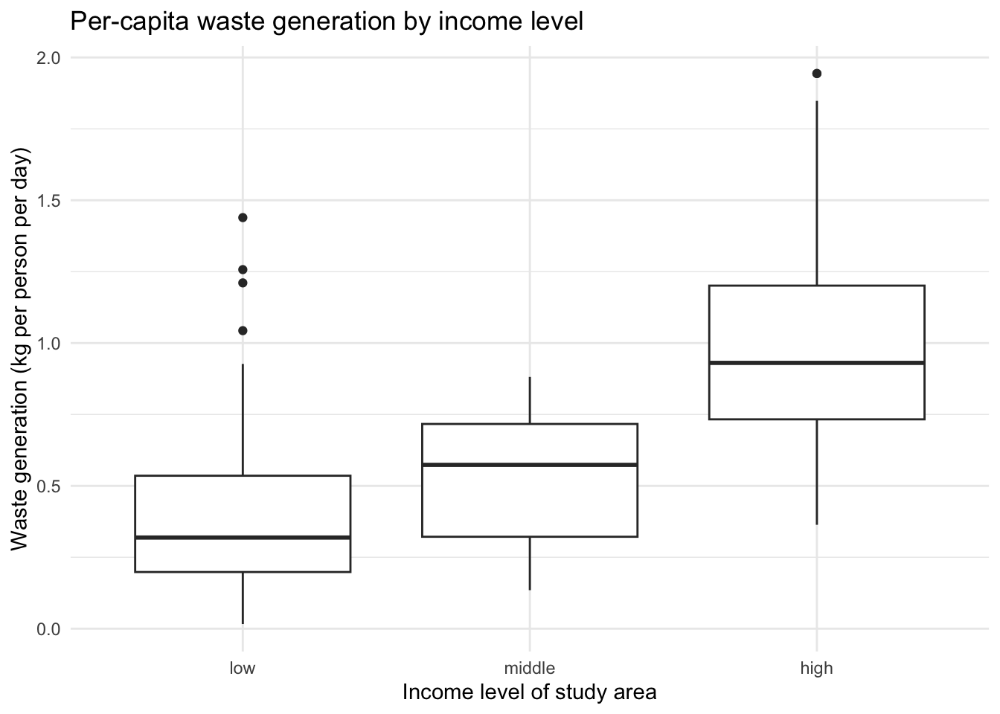

# solidwastekampala

The solidwastekampala package provides the household-level data behind
the manuscript “Quantity and Composition of Domestic Solid Waste in
Kampala City as Influenced by Socio-Economic Factors” (Katukiza et al.,
Makerere University). Over a seven-day measurement campaign, the study
team weighed the domestic solid waste generated by 103 households in
three Kampala parishes selected to represent different income levels:
Bwaise I (low), Bukoto I (middle), and Ggaba (high). Each record
combines the measured mass of ten waste categories with derived
per-household metrics and the socio-economic characteristics of the
household and its dwelling. The package contains one analysis-ready
dataset together with a full variable dictionary.

## Installation

You can install the development version of solidwastekampala from
[GitHub](https://github.com/) with:

``` r

# install.packages("devtools")
devtools::install_github("openwashdata/solidwastekampala")
```

``` r

## Run the following code in console if you don't have the packages
## install.packages(c("dplyr", "knitr", "readr", "stringr", "gt", "kableExtra"))
library(dplyr)
library(knitr)
library(readr)
library(stringr)
library(gt)
library(kableExtra)
```

Alternatively, you can download the individual datasets as a CSV or XLSX
file from the table below.

1.  Click Download CSV. A window opens that displays the CSV in your
    browser.
2.  Right-click anywhere inside the window and select “Save Page As…”.
3.  Save the file in a folder of your choice.

| dataset | CSV | XLSX |
|:---|:---|:---|
| solidwastekampala | [Download CSV](https://github.com/openwashdata/solidwastekampala/raw/main/inst/extdata/solidwastekampala.csv) | [Download XLSX](https://github.com/openwashdata/solidwastekampala/raw/main/inst/extdata/solidwastekampala.xlsx) |

## Data

The package provides access to one dataset with the waste measurements
and socio-economic characteristics of the 103 analyzed households.

``` r

library(solidwastekampala)
```

### solidwastekampala

The dataset `solidwastekampala` contains the mass of ten waste
categories collected from each household over a seven-day period, the
derived per-household metrics (total, per-day, per-capita, volume, and
density), and the socio-economic characteristics of the household and
its dwelling. It has 103 observations and 37 variables.

``` r

solidwastekampala |> 
  head(3) |> 
  gt::gt() |>
  gt::as_raw_html()
```

| id | household_id | division | parish | zone | income_level | occupants | age_head | gender_head | education_head | profession_head | monthly_income_ugx | respondent | period_of_stay | occupancy | housing_quality | roof_material | wall_material | floor_material | water_access | sanitation_facility | road_condition | waste_food_kg | waste_garden_kg | waste_wood_kg | waste_textiles_kg | waste_paper_kg | waste_polythene_kg | waste_plastics_kg | waste_glass_kg | waste_metals_kg | waste_other_kg | waste_total_kg | waste_per_day_kg | waste_per_capita_kg | volume_l | density_kg_l |
|---:|:---|:---|:---|:---|:--:|---:|:--:|:---|:--:|:---|:--:|:---|:--:|:---|:---|:---|:---|:---|:---|:---|:---|---:|---:|---:|---:|---:|---:|---:|---:|---:|---:|---:|---:|---:|---:|---:|
| 1 | Household_1 | Kawempe | Bwaise I | Lubagge | low | 3 | 18-35 | Male | Secondary | Business | \<500,000 | Spouse | 1-3 years | Rented | Bungalow | Iron sheets/tiles | Bricks | Cemented | Yard tap | Shared facilities | Unpaved | 6.99 | 0.094 | 0 | 0.027 | 0.017 | 0.077 | 0.077 | 0 | 0 | 0.042 | 7.324 | 1.0462857 | 0.3487619 | 10 | 0.4740000 |
| 2 | Household_2 | Kawempe | Bwaise I | Lubagge | low | 7 | 36-60 | Male | Illiterate | Business | 500,000-1,000,000 | Son/daughter | \>5 years | Occupied by owner | Bungalow | Iron sheets/tiles | Bricks | Tiles | Yard tap | Not shared facilities | Unpaved | 12.43 | 0.000 | 0 | 0.041 | 0.300 | 0.217 | 0.138 | 0 | 0 | 0.000 | 13.126 | 1.8751429 | 0.2678776 | 30 | 0.4375333 |
| 3 | Household_3 | Kawempe | Bwaise I | Lubagge | low | 6 | 36-60 | Female | Secondary | Business | 500,000-1,000,000 | Household head | \>5 years | Occupied by owner | Bungalow | Iron sheets/tiles | Bricks | Tiles | Yard tap | Shared facilities | Unpaved | 0.00 | 0.000 | 0 | 0.000 | 0.000 | 4.560 | 0.000 | 0 | 0 | 0.000 | 4.560 | 0.6514286 | 0.1085714 | 12 | 0.3800000 |

For an overview of the variable names, see the following table.

| variable_name | variable_type | description |
|:---|:---|:---|
| id | integer | Package-level unique household identifier (1-103), following the row numbering of the All_data sheet in the raw workbook (Bwaise I, then Bukoto I, then Ggaba). |
| household_id | character | Household label as recorded on the area sheet (for example Household_7); values repeat across parishes and contain gaps, so id is the unique key. |
| division | character | Kampala City division the household is located in (Kawempe, Makindye, or Nakawa). |
| parish | character | Study parish the household is located in (Bwaise I = low income, Bukoto I = middle income, Ggaba = high income area). |
| zone | character | Administrative zone within the parish where the household is located. |
| income_level | c(“ordered”, “factor”) | Income level of the household’s study area as classified in the study design; ordered factor with levels low \< middle \< high. |
| occupants | integer | Number of people living in the household during the 7-day waste collection period. |
| age_head | c(“ordered”, “factor”) | Age of the household head in years; ordered factor with levels 18-35 \< 36-60 \< \>60. |
| gender_head | character | Gender of the household head (Female or Male). |
| education_head | c(“ordered”, “factor”) | Highest education level of the household head; ordered factor with levels Illiterate \< Primary \< Secondary \< Tertiary. |
| profession_head | character | Profession of the household head (Business, Government employee, Housewife, Private employee, or Retired). |
| monthly_income_ugx | c(“ordered”, “factor”) | Monthly household income band in Uganda shillings (UGX); ordered factor with levels \<500,000 \< 500,000-1,000,000 \< 1,000,000-3,000,000 \< \>3,000,000. |
| respondent | character | Household member who answered the questionnaire (Household head, Spouse, Son/daughter, or Niece/nephew). |
| period_of_stay | c(“ordered”, “factor”) | How long the household has lived at the premises; ordered factor with levels \<1 year \< 1-3 years \< 3-5 years \< \>5 years. |
| occupancy | character | Occupancy status of the premises (Occupied by owner or Rented). |
| housing_quality | character | Type of dwelling as a proxy for housing quality (Bungalow, Story building, or Temporary). |
| roof_material | character | Main roof material of the dwelling (Cemented, Iron sheets, Iron sheets/tiles, or Tiles); Bwaise I recorded only the combined Iron sheets/tiles category. |
| wall_material | character | Main wall material of the dwelling (Bricks, Concrete blocks, or Mud/poles). |
| floor_material | character | Main floor material of the dwelling (Cemented, Mud, or Tiles). |
| water_access | character | Main drinking water access of the household (House connection, Stand pipe, or Yard tap). |
| sanitation_facility | character | Whether the household’s sanitation facility is shared with other households (Shared facilities or Not shared facilities). |
| road_condition | character | Condition of the access road to the household (Paved or Unpaved). |
| waste_food_kg | numeric | Mass of food waste generated by the household over the 7-day collection period, in kilograms (ASTM waste category). |
| waste_garden_kg | numeric | Mass of garden waste generated by the household over the 7-day collection period, in kilograms (ASTM waste category). |
| waste_wood_kg | numeric | Mass of wood waste generated by the household over the 7-day collection period, in kilograms (ASTM waste category). |
| waste_textiles_kg | numeric | Mass of textile waste generated by the household over the 7-day collection period, in kilograms (ASTM waste category). |
| waste_paper_kg | numeric | Mass of paper waste generated by the household over the 7-day collection period, in kilograms (ASTM waste category). |
| waste_polythene_kg | numeric | Mass of polythene waste generated by the household over the 7-day collection period, in kilograms (ASTM waste category). |
| waste_plastics_kg | numeric | Mass of plastic waste generated by the household over the 7-day collection period, in kilograms (ASTM waste category). |
| waste_glass_kg | numeric | Mass of glass waste generated by the household over the 7-day collection period, in kilograms (ASTM waste category). |
| waste_metals_kg | numeric | Mass of metal waste generated by the household over the 7-day collection period, in kilograms (ASTM waste category); for Ggaba Household_7 the value 2.674 was stored as text in the raw sheet and is excluded from that household’s recorded waste_total_kg. |
| waste_other_kg | numeric | Mass of waste not covered by the other nine categories, generated by the household over the 7-day collection period, in kilograms (ASTM waste category). |
| waste_total_kg | numeric | Total mass of waste generated by the household over the 7-day collection period, in kilograms, as recorded in the raw sheet (SUM of the ten category columns). |
| waste_per_day_kg | numeric | Mean daily mass of waste generated by the household, in kilograms per day (waste_total_kg divided by 7). |
| waste_per_capita_kg | numeric | Mean daily mass of waste generated per household member, in kilograms per person per day (waste_per_day_kg divided by occupants). |
| volume_l | numeric | Volume of the waste generated by the household over the 7-day collection period, in litres. |
| density_kg_l | numeric | Bulk density of the generated waste, in kilograms per litre; multiply by 1000 for kg/m3 as reported in the manuscript. |

## Example

The example reproduces the headline figures of the manuscript: mean
per-capita waste generation and mean waste density by income level.

``` r

library(solidwastekampala)
library(dplyr)
library(ggplot2)

solidwastekampala |>
  group_by(income_level) |>
  summarise(
    households = n(),
    waste_kg_capita_day = round(mean(waste_per_capita_kg), 2),
    density_kg_m3 = round(mean(density_kg_l) * 1000)
  )
#> # A tibble: 3 × 4
#>   income_level households waste_kg_capita_day density_kg_m3
#>   <ord>             <int>               <dbl>         <dbl>
#> 1 low                  39                0.43           368
#> 2 middle               32                0.53           571
#> 3 high                 32                0.98           325
```

The figure `boxplot-per-capita` below shows the distribution behind
those means: per-capita waste generation rises with the income level of
the study area, from 0.43 kg per person per day in Bwaise I (low) to
0.98 kg in Ggaba (high), where the spread across households is also
widest.

``` r

ggplot(solidwastekampala,
       aes(x = income_level, y = waste_per_capita_kg)) +
  geom_boxplot() +
  labs(
    x = "Income level of study area",
    y = "Waste generation (kg per person per day)",
    title = "Per-capita waste generation by income level"
  ) +
  theme_minimal()
```



## License

Data are available as
[CC-BY](https://github.com/openwashdata/solidwastekampala/blob/main/LICENSE.md).

## Citation

Please cite this package using:

``` r

citation("solidwastekampala")
#> To cite package 'solidwastekampala' in publications use:
#> 
#>   Katukiza A, Niwagaba C, Feni I, Namagembe S, Semiyaga S, Batte A,
#>   Schöbitz L, Manga M (2026). "solidwastekampala: Quantity and
#>   Composition of Domestic Solid Waste in Kampala City."
#>   doi:10.5281/zenodo.21519797
#>   <https://doi.org/10.5281/zenodo.21519797>.
#>   <https://openwashdata.github.io/solidwastekampala/>.
#> 
#> A BibTeX entry for LaTeX users is
#> 
#>   @Misc{katukiza_etall:2026,
#>     title = {solidwastekampala: Quantity and Composition of Domestic Solid Waste in Kampala City},
#>     author = {Alex Y. Katukiza and Charles B. Niwagaba and Ivan Feni and Shaluwa Namagembe and Swaib Semiyaga and Abubakar Batte and Lars Schöbitz and Musa Manga},
#>     year = {2026},
#>     doi = {10.5281/zenodo.21519797},
#>     url = {https://openwashdata.github.io/solidwastekampala/},
#>     abstract = {Domestic solid waste generation and composition data for 103 households in Kampala City, Uganda, collected over a seven-day measurement campaign in three parishes representing different income levels (Bwaise I, low income; Bukoto I, middle income; Ggaba, high income). Includes ten measured waste-category masses, derived per-household metrics, and household socio-economic characteristics. The data accompany the manuscript "Quantity and Composition of Domestic Solid Waste in Kampala City as Influenced by Socio-Economic Factors" (Katukiza et al., Makerere University).},
#>     version = {1.0.0},
#>   }
```
